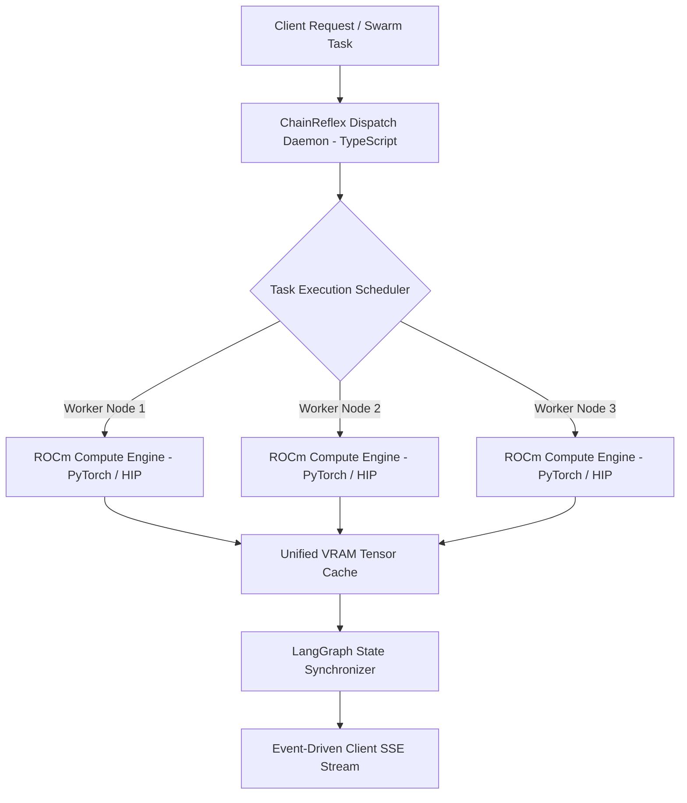

# ChainReflex-OS: Hardware-Accelerated Multi-Agent Swarm Runtime

> High-throughput, low-latency multi-agent execution operating system mapped directly to local AMD ROCm GPU compute acceleration.

[](https://www.amd.com/en/products/software/rocm.html)
[](https://www.typescriptlang.org/)
[](https://www.python.org/)
[](https://www.docker.com/)
[](LICENSE)

---

## Overview

Sequential agentic AI frameworks often bottleneck on CPU memory transfers and unoptimized GPU compute scheduling when running multiple concurrent reasoning swarms.

**ChainReflex-OS** is a specialized execution runtime that maps parallel multi-agent graph workflows directly to AMD ROCm-compatible hardware. By optimizing VRAM allocations, batching intermediate agent inference requests, and decoupling state transitions from UI streaming, ChainReflex-OS achieves high-throughput local agent execution without cloud latency.

---

## Runtime Architecture



---

## Core Components

1. **Dispatch Daemon (`src/`, `clients/`)**: High-concurrency TypeScript daemon managing client websocket connections and task queues.
2. **ROCm Compute Engine (`src/engine/`)**: Python-based acceleration layer interfacing directly with ROCm HIP runtimes and PyTorch tensor operations.
3. **Hardware Supervisor (`setup_and_start.sh`, `start_backend.bat`)**: Automated verification script validating ROCm driver initialization (`rocm-smi`), VRAM availability, and containerized dependencies.

---

## Repository Structure

```
.
├── clients/                  # TypeScript and Python client SDKs
├── config/                   # Swarm definitions, model weights config, and scheduler parameters
├── demo/                     # Demonstration scripts and benchmark runs
├── deploy/                   # Container definitions and deployment configurations
├── src/                      # Core agent runtime and ROCm execution engines
├── setup_and_start.sh        # Linux ROCm environment initialization script
├── start_backend.bat         # Windows development startup script
├── Dockerfile                # Production container specification
├── render.yaml               # Cloud deployment blueprint
└── requirements.txt          # Python runtime dependencies
```

---

## Getting Started

### Hardware Prerequisites
- AMD Radeon / Instinct GPU supporting ROCm (or CPU fallback mode)
- Linux with ROCm 6.x drivers installed (or Windows WSL2 ROCm bridge)

### Setup & Launch
```bash
# Clone the repository
git clone https://github.com/HamzaKhanBUIC/ChainReflex-OS.git
cd ChainReflex-OS

# Run the automated hardware check and environment setup
bash setup_and_start.sh
```

---

## License

MIT License - see [LICENSE](LICENSE) for details.
```
