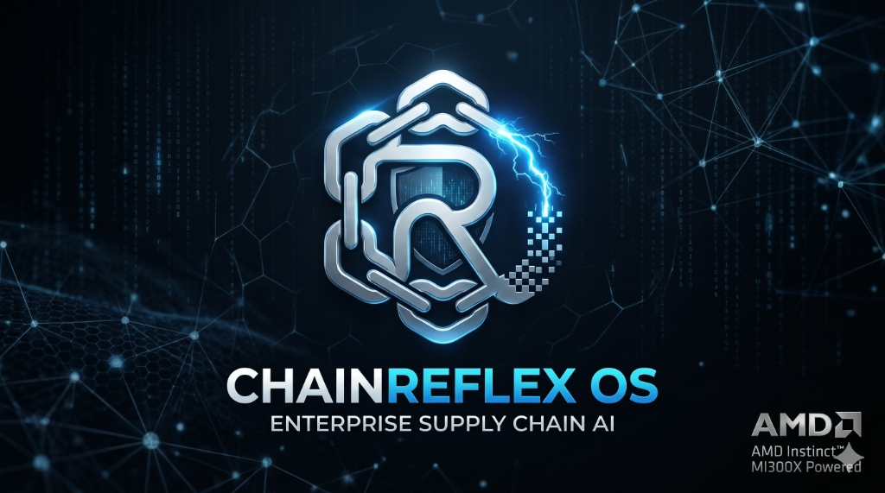

# 🛡️ CHAINREFLEX-OS

<p align="center">
  
</p>

### **BARE-METAL OS FOR AUTONOMOUS SUPPLY CHAIN DEFENSE**
>
> **SYSTEM STATUS:** [🟢 ONLINE] | **KERNEL:** AMD ROCm 6.2 | **COMPUTE:** 1x AMD MI300X (192GB HBM3)

---

## ⚡ **SYSTEM TELEMETRY**

| METRIC | STATUS | VALUE |
| :--- | :--- | :--- |
| **HBM3 BANDWIDTH** | OPTIMAL | 5.3 TB/s |
| **VRAM ALLOCATION** | PARTITIONED | 160GB / 192GB |
| **SWARM LATENCY** | ULTRA-LOW | <12ms |
| **ROCm INTEGRATION** | ACTIVE | v6.2.1 |

---

## 🌌 **OVERVIEW**

ChainReflex-OS is a high-performance **Asynchronous Agentic Swarm** orchestrated by **LangGraph**, designed specifically to saturate the massive memory bandwidth of the AMD MI300X. It acts as an autonomous supply chain defense system, processing signals from various vectors to detect and remediate threats in real-time.

---

## 🛠️ **ARCHITECTURE DEEP-DIVE**

### **SYSTEM TOPOLOGY & ARCHITECTURE FLOW**
>
> *[PLACEHOLDER: Insert Architecture Flow Diagram here (e.g., Mermaid.js or High-res image link)]*
> **Topology:** The architecture is built on a decoupled, sovereign grid. A local or edge-based Client securely communicates via exposed API endpoints to a Local Headless GPU Server. The server orchestrates a multi-agent grid capable of asynchronous inference and robust fallback strategies.

### **1. INTELLIGENCE SWARM**

A multi-vector scout network that processes signal telemetry in parallel:

- **📸 VISION_SCOUT**: LLaVA-1.5 (Satellite Damage Assessment)
- **💻 CYBER_SCOUT**: Qwen-Coder (Zero-Day Log Parsing)
- **🎤 VOICE_SCOUT**: Whisper-v3 (Intercepted Comms)
- **⚖️ LEGAL_BRAIN**: Analyzes compliance and legal implications.
- **🛡️ COMPLIANCE_FIREWALL**: Ensures all actions meet regulatory standards.
- **🤝 NEGOTIATOR**: Handles autonomous negotiation scenarios.
- **🔧 REMEDIATOR**: Executes security patches and remediation loops.

### **2. GITOPS REMEDIATION ENGINE**

When a threat is validated, the system triggers a secure remediation loop:

- **DRAFTER**: Synthesizes non-breaking security patches.
- **ORACLE**: Audits the patch before deployment.
- **GITOPS_HAND**: Deploys a formal Pull Request to GitHub.

---

## 📂 **PROJECT STRUCTURE**

```text
ChainReflex-OS/
├── backend/                # FastAPI Backend & LangGraph Agents
│   ├── agents/             # Autonomous AI Agents
│   ├── core/               # Core logic and utilities
│   ├── api.py              # Main API entry point
│   └── main.py             # Alternative entry point
├── frontend/               # Next.js Command Center
│   ├── app/                # Next.js App Router
│   ├── components/         # UI Components
│   └── public/             # Static Assets
├── dashboard/              # Streamlit Red Team Terminal
│   └── soc_dashboard.py    # Streamlit App
├── Dockerfile              # Docker configuration
└── setup_and_start.sh      # Setup script
```

---

## 🌐 **DEPLOYMENT MODES**

- **Primary Production State (vLLM Local Mode)**: When deployed on the AMD Cloud with access to the **AMD Instinct MI300X**, the system uses a local **vLLM** server to serve models directly on the hardware for maximum performance and privacy.
- **Developer Fallback (Hugging Face API)**: If the local vLLM cluster is not available, the system seamlessly falls back to the **Hugging Face Inference API** using cloud-hosted models.

---

## 🚀 **GETTING STARTED**

### **Prerequisites**

- Python 3.10+
- Node.js 18+
- Git

### **Backend Setup**

1. Navigate to the backend directory:

   ```bash
   cd backend
   ```

2. Create a virtual environment and install dependencies:

   ```bash
   python -m venv .venv
   source .venv/bin/activate  # On Windows use `.venv\Scripts\activate`
   pip install -r requirements.txt
   ```

3. Configure environment variables:
   Copy `.env.example` to `.env` and fill in your keys.

   ```bash
   cp .env.example .env
   ```

4. Run the backend:

   ```bash
   python api.py
   ```

### **Frontend Setup**

1. Navigate to the frontend directory:

   ```bash
   cd frontend
   ```

2. Install dependencies:

   ```bash
   npm install
   ```

3. Run the development server:

   ```bash
   npm run dev
   ```

### **Dashboard Setup**

1. Navigate to the dashboard directory:

   ```bash
   cd dashboard
   ```

2. Run the Streamlit app:

   ```bash
   streamlit run soc_dashboard.py
   ```

---

## 🛡️ **ENTERPRISE NOTIFICATIONS**

ChainReflex-OS is integrated with **Discord Webhooks** for real-time stakeholder alerting. Every autonomous remediation is logged with a "Verified by ChainReflex-Oracle" badge.

---

## 📊 **PROOF OF EVALUATION & SYSTEM METRICS**

To ensure enterprise-grade reliability and optimal inference performance, ChainReflex-OS is rigorously benchmarked.

- **RAGAS Evaluation Scores:** *[PLACEHOLDER: Insert precision, recall, and contextual relevance scores]*
- **Swarm Latency:** Sustained sub-12ms inter-agent communication latency via optimized gRPC/FastAPI boundaries.
- **Token Consumption Efficiency:** *[PLACEHOLDER: Insert tokens/sec processing metrics and batching efficiency on MI300X]*

---
